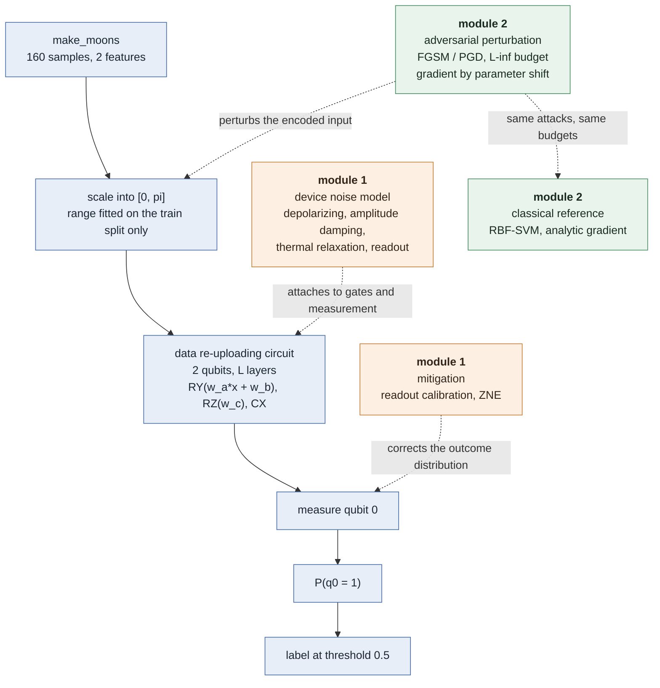

# quantum-security-lab

[](https://github.com/Vile13/quantum-security-lab/actions/workflows/ci.yml)

Research and engineering lab investigating the **security and robustness properties of quantum and hybrid quantum-classical machine learning systems**.

Part of a broader portfolio at the intersection of AI security, agent/tool security, and post-quantum cryptography.

## Try it

```bash
pip install -r qml-noise-robustness/requirements.txt
python demo.py
```

About 90 seconds. It trains a small classifier and then reproduces the lab's
three headline results in front of you: noise moving the model's outputs while
accuracy reports nothing, each mitigation correcting only its own mechanism,
and a gradient attack beating random noise of the same size.

The demo runs at reduced fidelity — fewer shots, one seed, a short training
budget — so its numbers are noisier than the 8-seed measurements in the module
READMEs, and it says so on the way past. `--quick` finishes in about ten
seconds and is visibly noisier still.

## Motivation

Quantum machine learning (QML) models are increasingly proposed for real-world deployment on noisy intermediate-scale quantum (NISQ) hardware. Unlike classical ML security, QML introduces attack surfaces that are specific to the quantum stack: device noise, transpilation, backend heterogeneity, and the encoding/measurement boundary between classical and quantum data. This lab treats these as **security and reliability properties to be measured, not assumed.**

Each module follows the same structure:
1. **Research question** — what property are we measuring?
2. **Threat / failure model** — what could go wrong, and why does it matter operationally?
3. **Experiment** — reproducible code, fixed seeds, documented parameters
4. **Results** — metrics, tables, plots
5. **Discussion** — limitations, what a mitigation would look like

## Modules

| Module | Status | Question |
|---|---|---|
| [`qml-noise-robustness`](./qml-noise-robustness) | ✅ v3 results | How does classification accuracy degrade under realistic Qiskit Aer noise models (depolarizing, amplitude damping, thermal relaxation, readout error), and does circuit depth trade off expressibility against noise resilience? |
| [`qml-adversarial-attacks`](./qml-adversarial-attacks) | ✅ results | Can small, targeted perturbations to classical input data flip QML classifier decisions, and how does this compare to classical adversarial robustness? |
| `circuit-parameter-tampering` | 📋 planned (roadmap) | What happens if variational parameters are tampered with post-training (supply-chain analogy for quantum models)? |
| `quantum-artificial-life` | 💡 idea (roadmap) | Emergent behavior in evolutionary/quantum artificial life systems — exploratory. |

## Architecture

Every module measures the same pipeline. What distinguishes them is **where
they intervene in it** — which is also why their findings turned out to be
independent of each other rather than two views of one effect.



| Module | Intervenes at | Measures |
|---|---|---|
| `qml-noise-robustness` | the circuit and the measurement | accuracy drop, and probability shift against the noiseless run of the same seed |
| `qml-adversarial-attacks` | the encoded input | flip rate among initially correct samples, against a random control of equal magnitude |

The shared stages live in [`qml_lab/`](./qml_lab); each module owns only its own
intervention, sweep and plots. The rule for putting something in `qml_lab/` is
that a second module already needs it — code moved in anticipation of reuse
tends to acquire parameters for situations that never arrive.

**Why the two findings are independent.** Module 1 showed that device noise
moves `P(q0 = 1)` substantially — 0.039 on the composite device model. Module 2
found that this movement neither protects against nor assists an adversarial
perturbation of the input. The diagram is the reason: noise enters after the
encoding, in directions unrelated to the input-space direction an attacker
searches. A robustness argument built on either stage alone is incomplete.

## Tooling

- **Qiskit + Qiskit Aer** for circuit construction, simulation, and noise modeling
- **scikit-learn / NumPy / SciPy** for classical data handling and optimization
- **matplotlib** for result visualization

## Responsible research statement

All experiments run against local simulators or explicitly self-owned test setups. No experiments target third-party systems, production infrastructure, or real quantum hardware without authorization. This lab is for research, benchmarking, and portfolio demonstration purposes.

## Repository layout

```
quantum-security-lab/
├── qml_lab/                  # shared: dataset, VQC, noise models
├── qml-noise-robustness/     # module 1 — see its own README
│   ├── noise_robustness/     #   sweep, mitigation, plots
│   ├── tests/                #   invariants that would otherwise fail silently
│   ├── results/              #   committed results and figures
│   └── run_experiment.py     #   entry point
├── qml-adversarial-attacks/  # module 2 — same layout
│   └── adversarial/          #   gradients, attacks, classical reference
├── tests/                    # smoke test for the demo
├── demo.py                   # 90-second tour of all three findings
└── README.md                 # this file
```

`qml_lab/` holds only what more than one module needs. Everything specific to
one experiment stays in that module, so a module can be read on its own.

## Findings so far

**`qml-noise-robustness`** (8 seeds, error bars throughout) — at device-like
error rates, test accuracy showed **no degradation at any circuit depth**
(+0.003 ± 0.011 at worst), while the model's output probabilities shifted
measurably, and that shift grew with every entangling gate added — strictly, in
8 of 8 seeds. Readout error was the control and behaved like one: flat in depth
(1 of 8 seeds, about what chance gives), because it applies once at measurement
rather than accumulating per gate. The practical consequence is that an
acceptance test built on accuracy alone would pass a model whose decision
confidence has already eroded substantially.

Running it across seeds also **retracted a v1 claim**: the apparent optimum at
three layers was one draw from a wide distribution, and depth differences in
accuracy turned out not to be resolvable at this sample size at all.

Adding mitigation (readout calibration and zero-noise extrapolation) recovers
**85% of that shift** on the realistic device model, and each technique corrects
only its own mechanism — ZNE removes exactly −0.0% ± 0.0 of a pure measurement
error, across all 32 runs. That zero is what separates a real correction from a
technique that merely smooths outputs. It also **retracted a v2 recommendation**:
readout calibration, dismissed there as the least useful mitigation, turns out
to be the best one per unit of cost.
[Details, method and limitations →](./qml-noise-robustness)

**`qml-adversarial-attacks`** (8 seeds, paired comparisons) — gradient attacks
built on exact parameter-shift derivatives beat a same-magnitude random control
in **8 of 8 seeds** for every model, so the flip rates mean something. Against
an RBF-SVM of comparable clean accuracy, attacked identically, the result is a
**null**: no paired difference in vulnerability is significant (p = 0.29–0.35),
and a single seed that appeared to show the VQC being twice as fragile did not
survive the other seven.

What does separate the models is consistency. The VQC's flip rate at ε = 0.4
ranges from 16% to 54% across seeds (SD 0.134) against the SVM's 27% to 49%
(SD 0.070) — a model whose adversarial robustness cannot be characterised by
testing the one instance you happen to have. Device noise turned out to be
neither a defence nor an extra weakness, making noise and adversarial
perturbation **independent failure modes**.
[Details, method and limitations →](./qml-adversarial-attacks)

## Roadmap

- [x] `qml-noise-robustness` — baseline model, noise sweep, results writeup
- [x] CI (ruff lint + pytest on Python 3.10 and 3.12) via GitHub Actions
- [x] `qml-noise-robustness` v2 — 8-seed sweep with error bars, depth-scaling tested across seeds
- [x] `qml-noise-robustness` v3 — mitigation comparison (readout calibration, zero-noise extrapolation, both)
- [x] `qml-adversarial-attacks` — FGSM/PGD via parameter-shift gradients, classical comparison, random control
- [x] Architecture diagram + short demo (`demo.py`)
- [ ] `circuit-parameter-tampering`
- [ ] `quantum-artificial-life`

## License

Licensed under [Apache License 2.0](./LICENSE).

## Citation

See [`CITATION.cff`](./CITATION.cff). GitHub renders a "Cite this repository" button from it automatically.

## About

Maintained as part of an ongoing research and security engineering portfolio at the intersection of AI security, quantum software security, and post-quantum cryptography.
