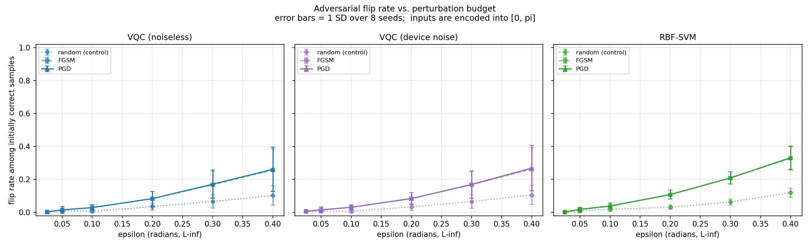

# qml-adversarial-attacks

Can a small, targeted perturbation of the classical input flip a variational
quantum classifier's decision — and is the quantum model more or less exposed
than a classical one of comparable accuracy?

## 1. Research question

1. **Is the VQC attackable at all?** Does a gradient-guided perturbation flip
   more decisions than random noise of the same magnitude?
2. **How does it compare to a classical model** of comparable clean accuracy,
   attacked identically at identical budgets?
3. **Does device noise change anything?** `qml-noise-robustness` showed that
   noise moves the model's output probabilities substantially. Does that
   perturbation act as an accidental defence, or as extra exposure?

## 2. Threat model

The attacker controls the **classical input** before it is encoded, within an
L∞ budget of ε radians. They know the model — architecture and trained weights
— which is the standard white-box assumption and the conservative one: a
defence that only works while the attacker is ignorant is not a defence.

They do **not** control the circuit, the weights, the backend, or the
measurement. Tampering with trained parameters is a different threat and is
scoped to a separate module (`circuit-parameter-tampering`).

| Failure | Operational consequence |
|---|---|
| Input perturbation flips a decision | Classification is wrong while the model reports normal confidence |
| Perturbation is smaller than sensor noise | The attack is indistinguishable from ordinary measurement error |
| Model is more fragile than the classical baseline it replaced | Adopting QML silently reduces robustness, with no signal in the accuracy report |

## 3. Setup

**Data and model.** Identical to `qml-noise-robustness`: `make_moons`, 80/80
stratified split, features scaled into `[0, π]`, a 3-layer data re-uploading VQC
on two qubits. Both live in the shared `qml_lab/` package, so the model under
attack here is the same object that module measured.

**Classical reference.** An RBF-SVM — the same baseline `qml-noise-robustness`
quotes at 0.963 on this data. Chosen over a neural network because its decision
function has a closed-form input gradient, so **both** sides of the comparison
are attacked with exact gradients rather than one exact and one approximated.

**Budget.** ε is L∞ in radians on the encoded inputs. Since the encoding range
is `[0, π]`, ε = 0.1 is 3.2% of the range and ε = 0.4 is 12.7%. The sweep runs
ε ∈ {0.025, 0.05, 0.1, 0.2, 0.3, 0.4}, over 8 seeds.

**Metric.** Flip rate among samples the model classified **correctly before the
attack**. Points already misclassified cannot be flipped into an error, and
counting them would let a weaker model look robust simply by having less to
lose.

## 4. Gradients

The attack is only as good as its gradient, so this is the part most worth
getting exactly right — a weak gradient produces a weak attack, and a weak
attack reads as evidence of robustness.

**The quantum gradient is exact**, via the parameter-shift rule rather than
finite differences. For a gate `RY(θ)`:

```
d⟨O⟩/dθ = [ ⟨O⟩(θ + π/2) − ⟨O⟩(θ − π/2) ] / 2
```

which holds exactly at any shot count, unlike a finite difference whose step
size trades bias against variance with no good setting on a noisy objective.

Getting from there to `d/dx` takes one observation. The encoding angle is
`θ_l = w_scale_l · x_q + w_bias_l`, so shifting the **bias** by ±π/2 shifts that
gate's angle by exactly ±π/2 — and the bias is already a circuit parameter. So
the shift is applied through the existing weight vector, with no need to rebuild
the circuit with per-gate parameters, and the chain rule gives

```
df/dx_q = Σ_layers  w_scale_l · (df/dθ_l)
```

`tests/test_attacks.py` checks this against an **exact statevector derivative**
(agreement to 1e-5), not against another approximation. A separate test sets
every input scale to zero and asserts the gradient vanishes, which anchors the
chain-rule factor independently of the parameter-shift terms.

**The classical gradient is exact too**, in closed form from the SVM's support
vectors — verified against finite differences to 1e-6.

## 5. Attacks, and the control

| Attack | Description |
|---|---|
| `random` | A uniformly random corner of the L∞ ball — **the control** |
| `fgsm` | One full-budget step along the sign of the loss gradient |
| `pgd` | 5 steps of ⅓ budget each, re-projected into the ball after every step |

The random control is not filler. A gradient attack that flips no more than
random noise of the same magnitude has demonstrated nothing about the model —
and specifically, it cannot distinguish "the model is robust" from "the gradient
was too noisy to follow", which is a live possibility when the gradient comes
from a finite number of shots. Every flip rate reported in §7 is only meaningful
because §7.1 shows the gradient attacks beat their control.

Perturbed inputs are **not** clipped back into `[0, π]`. Angles outside that
range are still legal circuit inputs — they simply rotate further — so bounding
them would constrain the attacker rather than describe the model.

## 6. Reproducing

```bash
pip install -r requirements.txt
python run_experiment.py
```

About 15 minutes on a 4-core laptop. `--seeds 42` runs a single seed in roughly
8 minutes. See `qml-noise-robustness/README.md` §5.1 for why results are seeded
but not bit-exact between runs.

```bash
pytest -q          # from the repository root
```

**Cost note.** FGSM evaluates its gradient at the clean input, which does not
depend on ε — only the step length does. Computing it once instead of once per
budget removes five sixths of that attack's cost; on the quantum models a single
gradient is `2 × layers × n_features` circuit runs.

## 7. Results

8 seeds (42–49), 80 test samples. Values are mean ± 1 SD across seeds. Because
all three models share each seed's split, model comparisons are reported as
**paired** differences, which resolve far more sharply than comparing means.
Full data in [`results/results.csv`](./results/results.csv).

Clean accuracy: VQC 0.906 ± 0.050, VQC under device noise 0.908 ± 0.051,
RBF-SVM 0.938 ± 0.032. The SVM's advantage is real but small (paired
difference 0.031, p = 0.044).

### 7.1 The attacks work — which is what makes the rest meaningful

| Model | FGSM beats random | PGD beats random |
|---|---|---|
| VQC (noiseless) | **8 / 8 seeds** | **8 / 8 seeds** |
| VQC (device noise) | **8 / 8 seeds** | **8 / 8 seeds** |
| RBF-SVM | **8 / 8 seeds** | **8 / 8 seeds** |

Every gradient attack beats its random control in every seed. That has to be
established before any flip rate is interpretable: without it, a low flip rate
could equally mean "robust model" or "gradient too noisy to follow", and the
quantum gradients here come from 4096 shots per circuit.

At ε = 0.4 the gap is large — PGD flips 26% of the VQC's correct predictions
against 10% for random noise of identical magnitude. The perturbation direction
matters roughly 2.5× more than its size.

### 7.2 Flip rate vs budget

| ε | VQC | VQC + noise | RBF-SVM | random control |
|---|---|---|---|---|
| 0.025 | 0.003 ± 0.006 | 0.007 ± 0.007 | 0.003 ± 0.006 | ~0.00 |
| 0.05 | 0.015 ± 0.020 | 0.015 ± 0.019 | 0.019 ± 0.013 | ~0.01 |
| 0.10 | 0.029 ± 0.018 | 0.031 ± 0.016 | 0.039 ± 0.019 | ~0.01 |
| 0.20 | 0.084 ± 0.043 | 0.084 ± 0.036 | 0.108 ± 0.028 | ~0.03 |
| 0.30 | 0.171 ± 0.085 | 0.170 ± 0.084 | 0.210 ± 0.037 | ~0.07 |
| 0.40 | 0.261 ± 0.134 | 0.269 ± 0.138 | 0.332 ± 0.070 | ~0.11 |



### 7.3 A single seed said the opposite

While developing this module, seed 42 alone showed the VQC flipping 37% against
the SVM's 16% at ε = 0.3 — a clean "quantum models are twice as fragile" story.

**Across 8 seeds that reverses, and then dissolves.** The VQC is nominally the
*less* flipped model at every budget above 0.025, but no paired difference is
significant:

| ε | Paired difference (VQC − SVM) | VQC worse in | Paired t-test |
|---|---|---|---|
| 0.20 | −0.025 ± 0.016 (SEM) | 2 / 8 seeds | — |
| 0.30 | −0.038 ± 0.038 (SEM) | 2 / 8 seeds | p = 0.35 |
| 0.40 | −0.071 ± 0.062 (SEM) | 2 / 8 seeds | p = 0.29 |

The honest conclusion is a null result: **at matched L∞ budgets these two models
are comparably attackable, and this experiment cannot separate them.** Seed 42
was not an error; it was one draw, and it happened to be the draw where the VQC
trained to an unusually fragile optimum.

One confound is worth stating: the VQC's clean accuracy is 0.031 lower, so it
enters each attack with fewer correct predictions to lose, and those may be the
easier ones. That biases the comparison mildly in the VQC's favour.

### 7.4 The quantum model's robustness is far less predictable

This is where the two models genuinely differ. At ε = 0.4:

| Model | SD across seeds | Range |
|---|---|---|
| VQC | 0.134 | 0.156 – 0.539 |
| RBF-SVM | 0.070 | 0.268 – 0.494 |

The VQC's spread is roughly twice the SVM's. At ε = 0.3 the variance ratio is
F = 5.29 (p = 0.043); at ε = 0.4 it is F = 3.63 (p = 0.111). So this is
suggestive rather than established at n = 8 — but the direction is consistent
across budgets, and the mechanism is plausible: the SVM's fit is a convex
problem with one solution, while the VQC's is a non-convex one whose optimum
depends on initialisation.

Operationally this is the more uncomfortable property. A mean flip rate can be
budgeted for. A model whose adversarial robustness ranges from 16% to 54%
depending on which training run shipped cannot be characterised by testing the
one instance you happen to have.

### 7.5 Device noise is not a defence, and not an extra weakness

Paired differences between the noiseless and noisy VQC are within ±0.008 at
every budget, with standard errors of comparable size — indistinguishable from
zero everywhere.

This is worth stating as a null result because both directions had a plausible
story. Noise perturbs the outputs (`qml-noise-robustness` measured a shift of
0.039 under this same device model), so it could have acted as accidental
randomised smoothing; equally, it could have pushed borderline samples across
the boundary and amplified the attack. It does neither. The noise moves outputs
in directions unrelated to the adversarial one, so it neither hides nor helps
the attack.

Combined with the earlier module, the picture is that device noise and
adversarial perturbation are **independent failure modes**: mitigating one says
nothing about the other, and a robustness argument built on either alone is
incomplete.

## 8. Limitations

- **Two features, two qubits, one dataset.** The absolute flip rates are
  properties of this problem. The comparison between models is the transferable
  part, and even that is one dataset.
- **L∞ on the encoded input only.** Attacks on the quantum state itself, on the
  encoding circuit, or on the trained parameters are out of scope.
- **No adversarial training or defence.** This measures the undefended
  baseline, in the same order this lab used for noise: measure first, mitigate
  second.
- **The SVM and the VQC are not matched on capacity**, only roughly on clean
  accuracy. A comparison of adversarial robustness between two model families
  always carries this caveat.
- **PGD with 5 steps** is a moderate attack. A stronger search would give a
  lower bound closer to the true worst case, so the flip rates here should be
  read as *at least this bad*, never as a robustness certificate.
