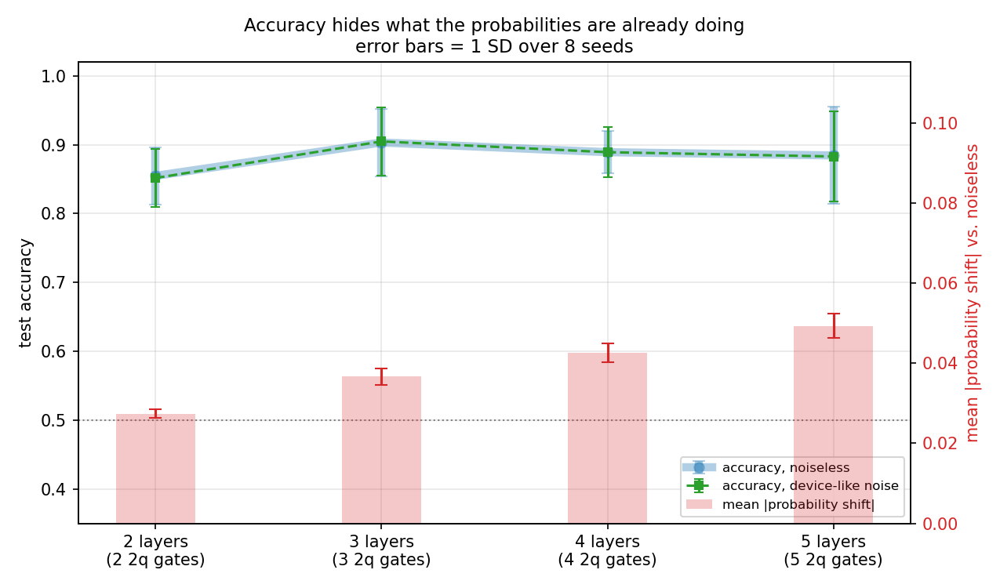
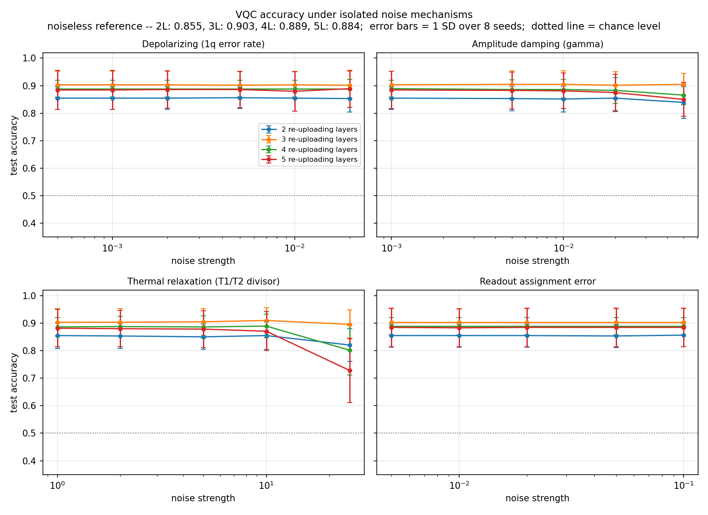
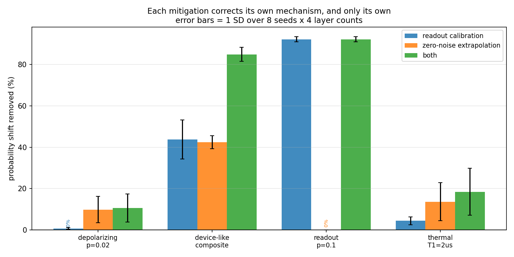

# qml-noise-robustness

How much classification accuracy does a variational quantum classifier lose
when it meets a noisy device, which noise mechanism costs the most, and does
adding circuit depth buy more than it costs?

## 1. Research question

A variational quantum classifier is trained on a noiseless simulator and then
deployed to hardware whose error profile it never saw. Two questions follow:

1. **Per mechanism** — how does test accuracy degrade under depolarizing noise,
   amplitude damping, thermal relaxation (T1/T2), and readout assignment error,
   each varied in isolation?
2. **Per depth** — a deeper circuit is more expressive but contains more
   entangling gates, and entangling gates carry the largest error rates. Where
   does the trade-off turn?

## 2. Threat and failure model

The concern is not an attacker manipulating a quantum computer. It is that a
QML model's accuracy is a property of the *model together with the device it
runs on*, while it is usually reported as a property of the model alone.

| Failure | Operational consequence |
|---|---|
| Model validated on a simulator, deployed to hardware | Reported accuracy does not transfer; the gap is unquantified |
| Backend heterogeneity (scheduler picks a different device) | Accuracy varies run to run with no code change and no error |
| Device calibration drifts between runs | Silent, gradual degradation with no failure signal |
| Readout miscalibration | Systematic label bias -- and unlike gate error, correctable after the fact |

The common thread is silence: none of these raise an exception. The circuit
executes, returns a bitstring distribution, and the classifier returns a label.
The failure mode is a **wrong answer delivered with full confidence**, which is
why the experiment tracks probability shift alongside accuracy — see §6.

## 3. Setup

**Data.** `make_moons` (160 samples, `noise=0.15`, seed 42), split 80/80
stratified. Two features, so each maps to exactly one qubit and no classical
dimensionality reduction sits between the data and the circuit. Features are
scaled to `[0, pi]` with the range fitted on the training split only.

**Model.** Two qubits, data re-uploading. Each layer re-encodes the input and
then applies trainable rotations:

```
for each layer:
    for each qubit q:  RY(w_a * x_q + w_b) ; RZ(w_c)
    CX(0, 1)
```

Readout is `P(qubit 0 = 1)`. Six weights per layer; layer counts 2, 3, 4, 5.

**Protocol.** Train per layer count on the **noiseless** simulator (COBYLA, 512
shots, up to 600 evaluations, 3 random restarts keeping the best), then freeze
the weights and evaluate them under every noise condition at 4096 shots. The
whole sweep is repeated over **8 seeds** (42–49) and every reported number is a
mean with a spread across them.

The restarts are not decoration. With a single start, 2 layers trained to 0.713
and looked like a capacity limit in the results table; a third restart reached
0.887 from the same architecture. Every restart's final loss is recorded in
`results.json` so the run-to-run spread stays visible rather than being hidden
behind the best result.

**What a seed controls.** The dataset and its split, the weight initialisation
of every restart, and the sampler's shot noise — all three at once. That is
deliberate: the resulting spread is what a reader would see on re-running the
experiment, which is what an error bar should mean. It does mean the error bars
on *absolute* accuracy are dominated by which 80 points landed in the test
split, and are correspondingly wide.

**Why the degradation resolves more sharply than the accuracy.** Each noise
condition is compared against the noiseless run **of its own seed**, so
`accuracy_drop` is a paired difference and the split variance cancels. A drop
can therefore be resolved to a precision the absolute accuracies never reach.
Wide error bars on accuracy next to tight ones on drop are not inconsistent —
they are the point of pairing.

Training noiseless and evaluating noisy is deliberate. It isolates the question
being asked — what does a model lose when it meets a noisy device — from the
separate question of whether training can compensate for noise it can observe.
It also matches the realistic deployment case.

## 4. Why not a fixed feature map

The first version of this module used the textbook architecture: `ZZFeatureMap`
for encoding, `RealAmplitudes` as the ansatz, parity readout. It was replaced
after measurement, and the reason is worth recording:

| Architecture | Weights | Test accuracy |
|---|---|---|
| `ZZFeatureMap(reps=2)` + `RealAmplitudes(reps=2)`, parity | 6 | 0.675 |
| `ZZFeatureMap(reps=2)` + `RealAmplitudes(reps=4)`, parity | 10 | 0.675 |
| `ZZFeatureMap(reps=1)` + `RealAmplitudes(reps=2)`, parity | 6 | 0.787 |
| Classical RBF-SVM, identical split | — | **0.963** |

Trained with **exact statevector simulation and no shot noise at all**, so this
is an architectural ceiling, not an optimisation artifact. Doubling the ansatz
parameters left the training loss unchanged to four decimal places — the added
freedom was inert.

This mattered for the experiment, not just for the score. With a noiseless
baseline near 0.70, the accuracy changes induced by noise were around ±0.012 —
exactly one test sample out of 80 — and several were *negative*, meaning the
model appeared to improve under noise. The measurement had no resolution.

Data re-uploading reaches the classical baseline on two qubits, which restores
the headroom the degradation measurement needs.

## 5. Reproducing

```bash
pip install -r requirements.txt
python run_experiment.py
```

Roughly 21 minutes on a 4-core laptop; `--workers 1` runs it serially in about
an hour and a half, `--seeds 42 43` cuts it down for a quick look. Writes
`results/results.json`, `results/results.csv`, `results/mitigation.csv` and
three figures. Output is sorted before writing, so worker scheduling does not
affect file contents.

### 5.1 Reproducibility is close but not bit-exact

An earlier version of this file claimed repeated runs produce byte-identical
files. **They do not**, and the claim was withdrawn after testing it rather
than assuming it. What was measured:

- The objective function *is* deterministic — 150 random weight vectors give
  bit-identical losses across separate processes.
- COBYLA *is* deterministic on a deterministic function — a pure NumPy
  objective reproduces `nfev` and the optimum exactly, every run.
- Yet COBYLA on *this* objective stops after a different number of evaluations
  between runs (176 vs 175 observed, from an identical start with identical
  first evaluations). Fixing `PYTHONHASHSEED` does not change it. The cause was
  not isolated and is somewhere in the Qiskit/Aer/SciPy stack.

Where a restart's trajectory diverges it can settle in a different local
optimum, so per-seed weights and absolute numbers vary slightly between runs.
Measured spread on a re-run of seed 42: test accuracy differs by at most 0.025
(two test samples), and every reported mitigation reduction in §10 lands within
1.7 percentage points of the committed value.

That is smaller than the seed-to-seed spread the error bars in §7 already
report, so the conclusions do not depend on it — but "seeded" and "bit-exact"
are not the same claim, and only the first one is true here.

The entry point pins every numeric library to a single thread before importing
them. That is a speedup, not a restriction: on two-qubit circuits Aer's internal
threading costs more than it saves (measured 118 ms vs 85 ms per objective
evaluation), and single-threaded workers then parallelise cleanly across seeds
rather than competing for the same cores.

```bash
pytest -q          # from the repository root; paths come from pyproject.toml
```

The tests target failure modes that still produce plausible output: swapped
parameter binding, a noise model attached to gate names the transpiler never
emits (and which is therefore silently inert), and the readout bit taken from
the wrong end of the register. Two tests are anchored on analytic values —
identity weights must give `P(q0=1) = 0`, and a unit input scale must give
`sin^2(x/2)`. `test_experiment.py` runs the whole sweep at throwaway fidelity
so a break in the orchestration or figure code cannot reach a commit unnoticed.

Both run in CI on every push, together with `ruff check .`.

## 6. Metrics

**Test accuracy**, and **mean absolute probability shift** relative to the
noiseless run on the same inputs.

The second metric exists because accuracy is thresholded and therefore blunt: a
prediction moving from 0.95 to 0.55 is a large loss of confidence and no change
in accuracy at all. Probability shift registers the erosion while the labels
still look correct — which is the regime a deployed model spends most of its
time in before accuracy visibly breaks.

## 7. Results

8 seeds (42–49), 80 test samples, 4096 evaluation shots. All values are mean ±
1 SD across seeds unless stated otherwise. Full per-seed data in
[`results/results.json`](./results/results.json), aggregates in
[`results/results.csv`](./results/results.csv).

### 7.1 Baseline, and a claim v1 got wrong

| Layers | 2q gates | Noiseless accuracy | SEM | Range across seeds |
|---|---|---|---|---|
| 2 | 2 | 0.853 ± 0.042 | 0.015 | 0.787 – 0.900 |
| 3 | 3 | 0.906 ± 0.050 | 0.018 | 0.800 – 0.963 |
| 4 | 4 | 0.889 ± 0.031 | 0.011 | 0.850 – 0.938 |
| 5 | 5 | 0.886 ± 0.069 | 0.024 | 0.787 – 0.988 |

**The single-seed version of this module reported that three layers was the
optimum. That claim does not survive.** The gap between 3 and 4 layers is 0.017
against standard errors of 0.018 and 0.011, and the per-seed ranges overlap
almost completely — five layers produced both the worst run (0.787) and the
best (0.988) in the whole sweep. Beyond two layers, this experiment cannot
resolve a depth ranking in accuracy at all, and the v1 number was one draw from
a wide distribution being read as a result.

Two layers is the one distinction that survives: it is consistently the weakest,
which is a capacity statement rather than a tuning artifact.

### 7.2 The main result, now with error bars

At device-like error rates the accuracy drop is indistinguishable from zero at
every depth — and the paired construction (§3) makes that a tight statement,
not a vague one:

| Layers | Accuracy drop under composite noise | Mean absolute probability shift |
|---|---|---|
| 2 | +0.0016 ± 0.0080 | 0.027 ± 0.001 |
| 3 | +0.0000 ± 0.0000 | 0.037 ± 0.002 |
| 4 | +0.0016 ± 0.0124 | 0.043 ± 0.002 |
| 5 | +0.0031 ± 0.0111 | 0.049 ± 0.003 |



The figure states the finding on its own: overlapping error bars on accuracy,
non-overlapping ones on probability shift. Note how much tighter the shift
error bars are (SD ≈ 0.002) than those on absolute accuracy (SD ≈ 0.05) —
probability shift is measured against a per-seed reference and is not exposed
to the split variance that dominates the accuracy column.

Pushed to the strongest setting of each mechanism, the gap widens:

| Mechanism (strongest setting) | L2 | L3 | L4 | L5 |
|---|---|---|---|---|
| Depolarizing, p=0.02 | 0.135 ± 0.004 | 0.197 ± 0.008 | 0.230 ± 0.011 | 0.263 ± 0.012 |
| Thermal, T1/T2 ÷ 25 | 0.115 ± 0.015 | 0.152 ± 0.011 | 0.194 ± 0.027 | 0.210 ± 0.024 |
| Amplitude damping, γ=0.05 | 0.090 ± 0.012 | 0.114 ± 0.009 | 0.150 ± 0.024 | 0.162 ± 0.021 |
| Readout, p=0.1 | 0.064 ± 0.002 | 0.071 ± 0.002 | 0.069 ± 0.003 | 0.070 ± 0.003 |

Depolarizing noise at p=0.02 moves output probabilities by 0.26 at five layers
— a quarter of the available range — for an accuracy change of −0.003 ± 0.015.

**An acceptance test built on accuracy alone would pass a model whose decision
confidence has already eroded substantially.** That was v1's claim from one
seed; across eight it holds with error bars that do not come close to zero.

### 7.3 Depth-scaling, tested rather than observed

v1 observed that probability shift grows with circuit depth. With 8 seeds that
can be checked instead of asserted: in how many seeds does the shift increase
strictly with *every* added layer?

| Mechanism | Strictly increasing in |
|---|---|
| Depolarizing | **8 / 8** |
| Composite device model | **8 / 8** |
| Thermal relaxation | 6 / 8 |
| Amplitude damping | 6 / 8 |
| Readout | **1 / 8** |

Readout is the control, and it behaves like one. It applies once at
measurement rather than accumulating per gate, so it has no reason to scale
with depth — and 1 of 8 is about what four values in random order would give
(chance is 1/4! ≈ 4%). Every gate-based mechanism separates clearly from it.

That contrast is the strongest evidence here that the noise models attach where
they are meant to: nothing in the setup forces readout to behave differently,
and it does, in the direction the mechanism predicts.

### 7.4 Where accuracy finally does break

One mechanism costs real accuracy once pushed past realistic levels — thermal
relaxation at a T1/T2 divisor of 25 (T1 = 2 µs):

| Layers | Accuracy drop |
|---|---|
| 2 | +0.031 ± 0.037 |
| 3 | +0.008 ± 0.031 |
| 4 | +0.089 ± 0.084 |
| 5 | +0.158 ± 0.132 |

Five layers lose nearly 16 percentage points. The standard deviation is
enormous (0.132) — some seeds collapse to chance while others barely move — so
the honest reading is that deep circuits under severe decoherence become
*unreliable* rather than uniformly worse. For a deployed model, high variance
across otherwise identical runs is its own failure mode.



Ranked by probability shift at the strongest setting: depolarizing > thermal
relaxation > amplitude damping > readout. The ordering reflects the error
magnitudes chosen in `qml_lab/noise_models.py` as much as the mechanisms
themselves, so read it as "at these rates", not as an intrinsic ranking.

## 8. Limitations

- **Two qubits, one dataset.** Nothing here extrapolates to circuit widths
  where noise accumulates across many entangling gates. The direction of the
  depth effect should hold; the magnitudes should not be transferred.
- **Simulated noise, not measured hardware.** Aer noise models are an
  idealisation. Real devices add crosstalk, non-Markovian effects, and
  qubit-to-qubit variation that the all-qubit models used here do not capture.
- **Eight seeds is a small sample.** Enough for a standard deviation that is
  informative rather than misleading, not enough for a confident claim about
  the shape of the distribution. The error bars should be read as "roughly this
  wide", and no significance test is claimed anywhere in §7.
- **Test-set resolution.** 80 samples means accuracy moves in steps of 0.0125,
  so a single-sample difference is not a finding. Pairing within seeds is what
  makes the drops resolvable at all.
- **Seeds are not independent across the layer axis.** Within one seed, all
  four layer counts share the same train/test split, which is what makes the
  depth comparison paired and sensitive — but it also means the four curves in
  a figure are correlated, not independent samples.
- **Two mitigations, both standard.** §9–10 measure readout calibration and
  linear ZNE. Richardson or exponential extrapolation, probabilistic error
  cancellation, and noise-aware training are all untested here, and the ZNE
  result in particular is a statement about *linear* ZNE at these error rates.
- **Accuracy on a balanced two-class problem** is a weak metric in general; it
  is adequate here because the split is stratified and the classes are equal.

## 9. Mitigation

Two standard techniques, chosen because they target different causes:

**Readout calibration.** Each basis state is prepared and measured on the same
backend the model runs on, giving a matrix `M` with `measured = M · true`. Every
measured distribution is then corrected by a least-squares solve against `M`,
clipped to non-negative and renormalised. The circuit is untouched; only the
interpretation of the counts changes.

**Zero-noise extrapolation (ZNE).** The circuit's unitary part is folded as
`U (U† U)^k`, which multiplies gate count — and therefore accumulated gate
error — by 1, 3 and 5 while leaving the ideal unitary unchanged. A line is
fitted through the three noise levels per sample and evaluated at zero noise.

Both are applied to the same conditions, and to the combination of the two.
The conditions are chosen so that each technique meets a case it should fix and
a case it should not touch — a mitigation that improved everything equally
would be smoothing numbers rather than correcting a mechanism.

### 9.1 Implementation notes that matter

Folding is separated by **barriers**. Without them the transpiler recognises
`U† U` as the identity and cancels it; the folded circuit is then no noisier
than the original, every scale returns the same value, and ZNE reports a
confident zero improvement that looks like a finding about ZNE rather than a
bug. `tests/test_mitigation.py` asserts that the two-qubit gate count really is
multiplied by the fold scale, and that folding leaves the *noiseless* output
unchanged.

**Extrapolation is linear, not Richardson.** With three shot-noisy points a
polynomial forced exactly through all of them mostly extrapolates the sampling
error, with a large lever arm.

**Both strategies are derived from the same shots.** Each fold scale is sampled
once and both the raw and the readout-corrected marginal are computed from that
one measurement. Beyond halving the runs, this makes the four strategies a
paired comparison — a difference between them is the mitigation, not a
different draw of shot noise.

**The calibration matrix is not a pure readout characterisation.** Its
preparation circuits use X gates, so on a backend with gate errors it absorbs a
little gate error too. That is a property of the technique, not of this
implementation, and §10 shows it having a visible consequence.

## 10. Mitigation results

8 seeds × 4 layer counts pooled, so n = 32 per cell. Values are the fraction of
the unmitigated probability shift removed, mean ± 1 SD. Full data in
[`results/mitigation.csv`](./results/mitigation.csv).



| Condition | Unmitigated shift | Readout calibration | ZNE | Both |
|---|---|---|---|---|
| Device-like composite | 0.039 ± 0.009 | 43.8% ± 9.4 | 42.5% ± 3.2 | **84.9% ± 3.4** |
| Readout, p=0.1 | 0.068 ± 0.004 | **92.2% ± 1.3** | **−0.0% ± 0.0** | 92.2% ± 1.3 |
| Depolarizing, p=0.02 | 0.206 ± 0.049 | 0.7% ± 0.4 | 9.8% ± 6.4 | 10.6% ± 6.8 |
| Thermal, T1 = 2 µs | 0.168 ± 0.042 | 4.4% ± 1.9 | 13.6% ± 9.2 | 18.5% ± 11.3 |

### 10.1 Each technique corrects its own mechanism, and only its own

The cleanest number in the table is a zero. **ZNE removes −0.0% ± 0.0 of a pure
readout error** — not approximately nothing, but nothing, with zero variance
across all 32 runs. Folding repeats the unitary; a measurement-time error is
applied once regardless, so all three noise scales return the same value, the
fitted line is flat, and the extrapolated intercept is the measured value.

The converse holds: readout calibration removes 0.7% ± 0.4 of pure depolarizing
noise, which is nothing it could not have got from re-rounding.

This matters more than the headline percentages. A mitigation that improved
every condition would be indistinguishable from one that merely pulled outputs
toward some average — and on a metric like probability shift, pulling toward
the mean *would* look like an improvement. The zeros are what rule that out.

### 10.2 On the realistic model, the two combine almost additively

For the composite device model — the condition that stands in for real
hardware — readout calibration recovers 43.8% and ZNE 42.5%. Together they
recover **84.9%**, against 86.3% if the effects were exactly additive. The two
mechanisms contribute roughly independently and are corrected roughly
independently.

Note also that the combined result has a *tighter* error bar (± 3.4) than
readout calibration alone (± 9.4). Correcting more of the error leaves less
mechanism-dependent variation for the seed to influence.

### 10.3 Readout calibration picks up thermal relaxation too

It removes 4.4% ± 1.9 of thermal relaxation — small, but the error bar excludes
zero, and there is a mechanism for it. Amplitude decay toward |0⟩ near the end
of the circuit is indistinguishable at measurement time from an asymmetric
readout error, and the calibration circuits — which use X gates and are
themselves subject to decay — absorb part of it into the matrix.

This is the limitation from §9.1 showing up as a measurable effect rather than
a caveat. It is not free: what the matrix absorbs is device- and
circuit-dependent, so a calibration matrix taken from short preparation
circuits will not correct a long circuit's decay in the same proportion.

### 10.4 Mitigation is weakest exactly where the damage is largest

Against strong single-mechanism gate noise, ZNE recovers only about 10–14%,
with error bars ± 6 to ± 9. Those are the two conditions with by far the
largest unmitigated shift (0.21 and 0.17, against 0.039 for the composite).

The reason is structural rather than incidental. ZNE assumes the observable is
approximately linear in noise strength over the range being extrapolated. At
p=0.02 depolarizing, a five-fold circuit carries 15 two-qubit gates and the
state is well on its way to maximally mixed — the response has flattened, and
a line fitted through the flat part extrapolates back to nearly where it
started.

So the honest summary is not "mitigation recovers most of the error." It is
that **mitigation recovers most of the error in the regime where the error was
small to begin with**, and degrades precisely as the problem gets harder.

### 10.5 Accuracy sees it in exactly one condition

In three of the four conditions the accuracy drop stays within noise whether or
not a mitigation is applied — as it did unmitigated in §7.2. On the composite
device model it is +0.002 ± 0.007 unmitigated and −0.000 ± 0.004 with both
mitigations: an 85% reduction in probability shift that accuracy reports as
nothing either way.

The exception is thermal relaxation at T1 = 2 µs, the one condition severe
enough to break accuracy in the first place (§7.4). There mitigation is clearly
visible in the metric:

| Strategy | Accuracy drop | SEM |
|---|---|---|
| none | +0.0715 | 0.0171 |
| readout calibration | +0.0582 | 0.0162 |
| ZNE | +0.0512 | 0.0147 |
| both | **+0.0379** | 0.0130 |

The loss falls from 7.2 to 3.8 percentage points — roughly halved — and the
ordering matches the probability-shift ordering exactly.

So the two metrics do not disagree about what mitigation does; they disagree
about **when it becomes visible**. Probability shift registers the correction in
every condition. Accuracy registers it only once the underlying damage has
grown large enough to move labels — by which point, per §7.4, the model's
run-to-run variance has already become its own failure mode.

For an operator, the practical consequence is unchanged and now better
supported: choosing a mitigation on the evidence of accuracy alone means
choosing it blind in exactly the regime where the choice is still cheap to act
on.

## 11. What this means in practice

## 11. What this means in practice

**A recommendation from v2 is withdrawn here.** On the strength of the
unmitigated sweep alone, this section argued that readout correction was the
obvious mitigation and the least useful one, because readout error cost the
least. Measuring it says otherwise: on the composite device model, readout
calibration removes 43.8% of the probability shift — statistically tied with
ZNE, and it does so from four calibration circuits measured once per device
rather than from folding every circuit to 3× and 5× its length. Per unit of
cost it is far and away the best thing on the list.

The error in the v2 reasoning is worth naming, because it is easy to repeat:
ranking mechanisms by how much damage they cause in isolation says nothing
about how much of a *realistic composite* error each one contributes. Readout
error is a small share of the total and a large share of the correctable total.

With that corrected, the priorities are:

**1. Calibrate readout.** Cheapest by a wide margin, no change to the circuit,
and worth 43.8% ± 9.4 of the shift on the realistic model.

**2. Reduce depth.** Every gate-based mechanism scales with entangler count in
8 of 8 seeds (§7.3), and beyond two layers the accuracy cost of using fewer is
too small for this experiment to resolve (§7.1). One change, every gate-based
mechanism, at a price the measurement cannot detect.

**3. Add ZNE if the shot budget allows.** Worth another 41 percentage points on
top of readout calibration on the composite model, for roughly 9× the shots.
Note its failure mode: against severe gate noise it recovers only 10–14%
(§10.4), so it is a refinement for an already-healthy device, not a rescue for
a bad one.

**4. Monitor probability shift, not accuracy.** This is the finding that
survived every version of this module. Accuracy detected none of the
degradation in §7.2 and none of the correction in §10.5, except in the single
condition already severe enough to be obvious. Any monitoring for a deployed
QML model should compare output distributions against a reference, not just
label agreement.

The uncomfortable version of all four points together: on the realistic
composite model, 85% of the measured corruption of this model's outputs is
correctable with standard techniques — and the metric normally used to decide
whether a model is working would have reported that nothing was ever wrong, and
that nothing was ever fixed.
